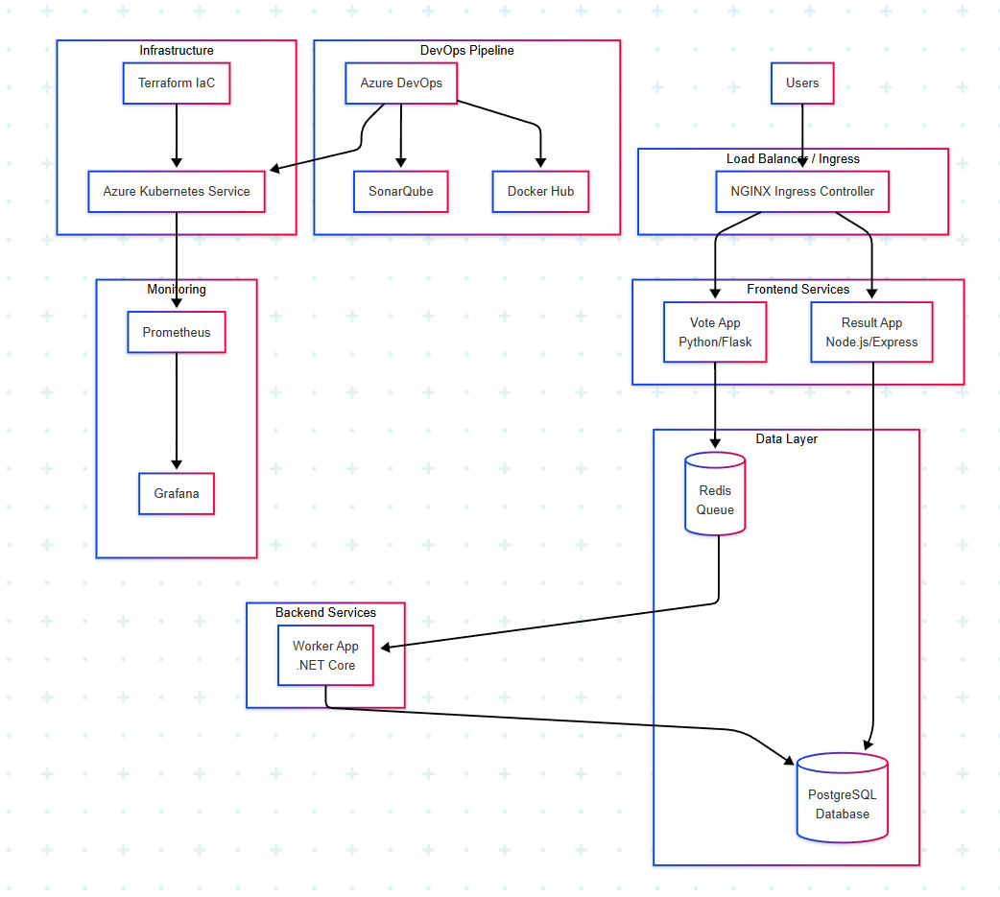
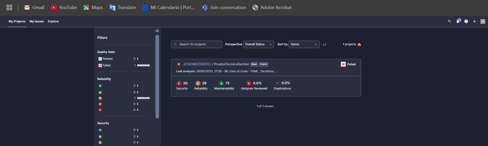
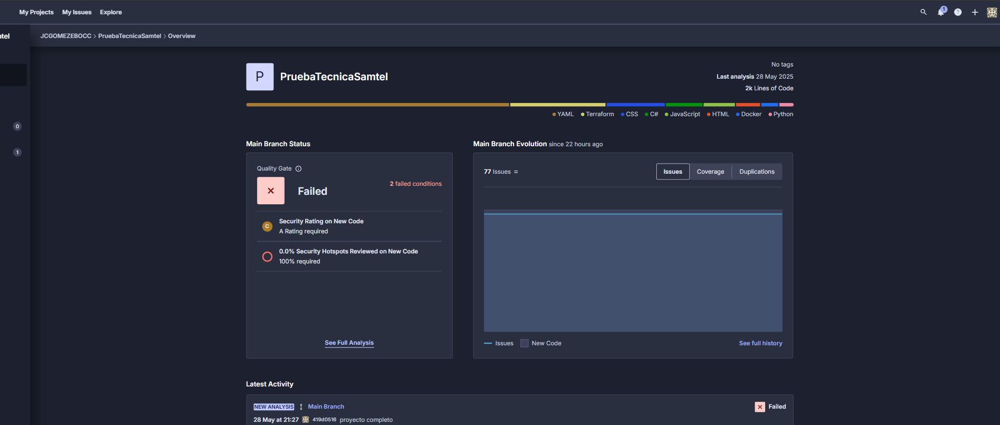
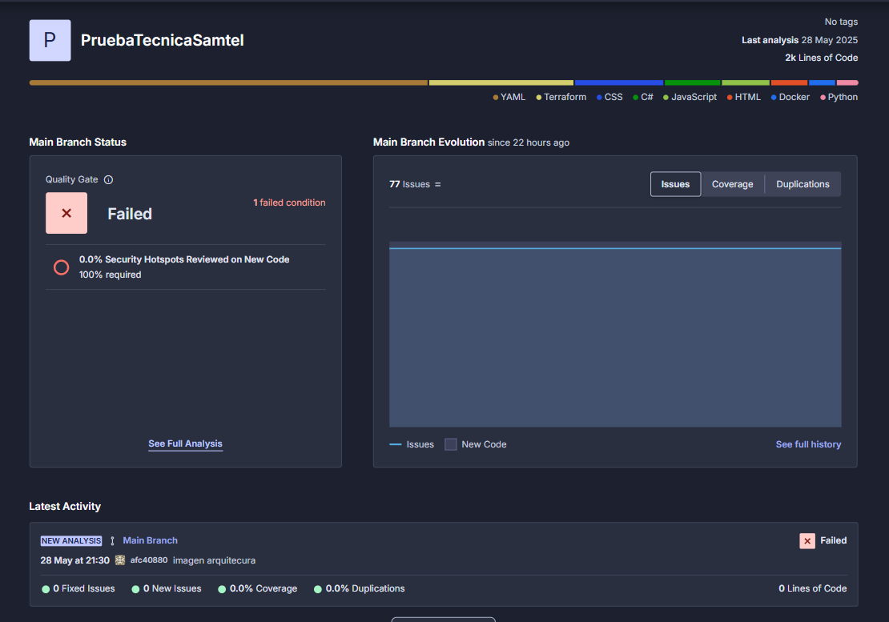
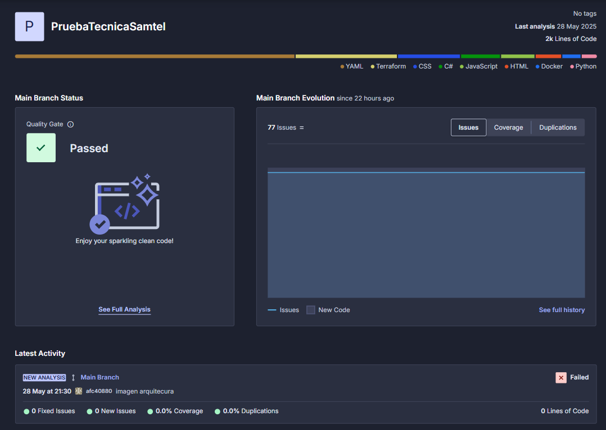
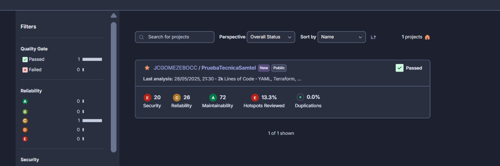

Prueba Técnica Samtel - Voting Application

Una implementación completa de DevOps/CloudOps que demuestra las mejores prácticas de CI/CD, análisis de código, containerización y orquestación de microservicios.

Tabla de Contenidos

Descripción del Proyecto
Arquitectura
Características
Instalación y Configuración
Uso con Docker
Despliegue en Kubernetes
Infrastructure as Code
Pipeline CI/CD

Descripción del Proyecto
La Prueba Técnica Samtel es una implementación completa de una aplicación de votación distribuida que demuestra las mejores prácticas de DevOps y CloudOps. El proyecto incluye:

Aplicación de Votación completa con múltiples microservicios
Pipeline CI/CD automatizado con Azure DevOps
Análisis de código con SonarQube (escenarios de éxito y fallo)
Containerización completa con Docker
Orquestación con Kubernetes
Infrastructure as Code con Terraform
Monitoreo con Prometheus y Grafana
Acceso externo con Ingress Controller

Funcionalidad de la Aplicación:
Los usuarios pueden votar entre dos opciones (por ejemplo: Gatos vs Perros) y ver los resultados en tiempo real. La aplicación demuestra:
- Comunicación entre microservicios
- Persistencia de datos
- Escalabilidad horizontal
- Alta disponibilidad

Arquitectura
Diagrama de Arquitectura:

Componentes de la Aplicación
ComponenteTecnologíaPuertoDescripciónVote AppPython/Flask80Frontend para votar entre dos opcionesResult AppNode.js/Express80Frontend para mostrar resultados en tiempo realWorker.NET Core-Procesa votos y actualiza la base de datosRedisRedis6379Cola de mensajes para almacenar votos temporalmentePostgreSQLPostgreSQL5432Base de datos principal para resultados
Stack Tecnológico

Frontend:
- Python 3.9+ con Flask
- Node.js 18+ con Express
- HTML5, CSS3, JavaScript
- WebSockets para actualizaciones en tiempo real

Backend:
- .NET 6 para el worker
- Redis para messaging
- PostgreSQL 13 para persistencia

DevOps & Infrastructure:
- Azure DevOps - CI/CD Pipeline
- SonarQube - Análisis de código
- Docker - Containerización
- Kubernetes - Orquestación
- Terraform - Infrastructure as Code
- Helm - Package Manager para K8s
- NGINX Ingress - Load Balancer

Características
DevOps Pipeline Completo:
1. Build automatizado de múltiples tecnologías
2. Análisis de código con SonarQube (escenarios éxito/fallo)
3. Tests unitarios y de integración
4. Cobertura de código >80%
5. Scripts paralelos (Hello World + creación de archivos)
6. Build y push de imágenes Docker
7. Despliegue automatizado en Kubernetes
8. Smoke tests post-despliegue

Instalación y Configuración
Prerrequisitos:

Software Requerido:
- Docker Desktop 4.0
- Kubernetes 1.27
- Azure CLI 2.50
- kubectl 1.27
- Helm 3.12
- Terraform
- Git 

Cuentas de Servicio:
- Azure DevOps Organization
- Docker Hub Account
- Azure Subscription
- SonarQube Server

Configurar Variables de Entorno:
archivo .env

Configurar Quality Gates
yamlCondiciones:
  - Coverage: >80%
  - Duplicated Lines: <3%
  - Maintainability Rating: A
  - Security Rating: A
  - Reliability Rating: A

Uso con Docker
Desarrollo Local
Build de Imágenes

# Build todas las imágenes
docker-compose build

# Build imagen específica
docker build -t voting-app-vote:latest src/vote/
docker build -t voting-app-result:latest src/result/
docker build -t voting-app-worker:latest src/worker/
Ejecutar la Aplicación:

# Iniciar todos los servicios
docker-compose up -d

# Ver logs
docker-compose logs -f

# Verificar estado
docker-compose ps

Despliegue en Kubernetes
Configuración del Cluster
Minikube
# Iniciar Minikube
minikube start --cpus=4 --memory=8192 --disk-size=20GB

# Habilitar addons
minikube addons enable ingress
minikube addons enable metrics-server

# Verificar estado
kubectl cluster-info
kubectl get nodes

Azure Kubernetes Service
# Login a Azure
az login

# Crear AKS cluster
az aks create \
  --resource-group rg-voting-app \
  --name aks-voting-app \
  --node-count 3 \
  --node-vm-size Standard_D2s_v3 \
  --enable-addons monitoring \
  --generate-ssh-keys

# Obtener credenciales
az aks get-credentials --resource-group rg-voting-app --name aks-voting-app

Infrastructure as Code
Terraform Configuration
Estructura de Archivos
terraform/
├── main.tf                 # Configuración principal
├── variables.tf            # Variables de entrada
├── outputs.tf              # Outputs del módulo
├── terraform.tfvars        # Valores de variables
└── environments/
    ├── dev.tfvars         # Variables para desarrollo
    ├── staging.tfvars     # Variables para staging
    └── prod.tfvars        # Variables para producción

Despliegue con Terraform
1. Inicializar Terraform
cd terraform

# Configurar backend remoto
terraform init

# Seleccionar workspace
terraform workspace select production
# o crear nuevo: terraform workspace new production

2. Planificar Infraestructura
bash# Plan para producción
terraform plan -var-file="environments/prod.tfvars" -out=tfplan

# Revisar plan
terraform show tfplan

3. Aplicar Cambios
# Aplicar infraestructura
terraform apply tfplan

# O aplicar directamente
terraform apply -var-file="environments/prod.tfvars" -auto-approve

Recursos Creados

Recurso	           Tipo	                                 Descripción
Resource Group	   azurerm_resource_group         	     Grupo de recursos principal
AKS Cluster	       azurerm_kubernetes_cluster	         Cluster Kubernetes gestionado
Virtual Network	   azurerm_virtual_network 	             Red virtual para AKS
Subnets	azurerm_   subnet	                             Subredes para nodos y pods
Log Analytics	   azurerm_log_analytics_workspace	     Workspace para logs
Container Registry azurerm_container_registry	         Registry privado para imágenes
Key Vault	       azurerm_key_vault	                 Gestión de secretos
Public IP	       azurerm_public_ip	                 IP pública para Load Balancer

Pipeline CI/CD
Azure DevOps Pipeline
El pipeline de CI/CD está completamente automatizado y ejecuta las siguientes etapas:

Stage 1: Build and Analysis
- Source Control: Checkout del código fuente
- Code Quality: Análisis con SonarQube
- Unit Tests: Ejecución de tests unitarios
- Code Coverage: Generación de reportes de cobertura
- Build Applications: Compilación de todas las aplicaciones

Stage 2: Parallel Jobs
- Job A: Script que imprime "Hello World" 10 veces
- Job B: Script que crea 10 archivos con fecha y timestamp

Stage 3: Docker Build & Push
- Build Images: Construcción de imágenes Docker
- Security Scan: Escaneo de vulnerabilidades
- Push to Registry: Subida a Docker Hub/ACR
- Image Verification: Verificación de imágenes publicadas

Stage 4: Kubernetes Deployment
- Infrastructure Validation: Verificación del cluster
- Deploy Applications: Despliegue de microservicios
- Configure Ingress: Configuración de acceso externo

SonarQube Integration

Análisis de Código

Análisis de Código con error

Análisis de Código sin error

